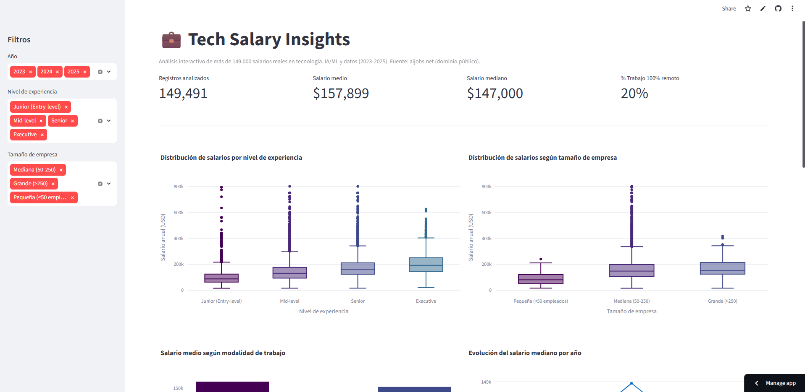

# 💼 Tech Salary Insights

Dashboard interactivo que analiza más de **149.000 salarios reales** en el sector tech, IA/ML y datos (2023-2025), con una capa de **IA generativa** que permite hacer preguntas en lenguaje natural sobre los datos filtrados.

🔗 **[Ver demo en vivo](https://tech-salary-insights-vnyuk3rlqsknccppxfkw7j.streamlit.app/)**



## ✨ Qué hace

- Explora salarios filtrando por año, nivel de experiencia y tamaño de empresa.
- Visualiza distribuciones, comparativas y tendencias con gráficas interactivas (Plotly).
- Pregunta directamente sobre los datos filtrados ("¿cuánto más gana un Senior que un Junior?") y recibe una respuesta generada por IA (Llama 3.3 vía Groq), basada en estadísticas reales del subconjunto seleccionado — no en datos inventados.

## 🛠️ Stack técnico

- **Python** · pandas para procesamiento de datos
- **Plotly** para visualizaciones interactivas
- **Streamlit** para la interfaz web
- **Groq API** (Llama 3.3 70B) para la capa de IA generativa
- Despliegue gratuito en **Streamlit Community Cloud**

## 📊 Fuente de datos

Dataset público de [aijobs.net](https://aijobs.net/salaries/) (dominio público, CC0), obtenido de [foorilla/ai-jobs-net-salaries](https://github.com/foorilla/ai-jobs-net-salaries), actualizado semanalmente.

## 🚀 Ejecutar en local

```bash
git clone https://github.com/JuanJoseRP94/tech-salary-insights.git
cd tech-salary-insights
python -m venv venv
source venv/bin/activate      # En Windows: venv\Scripts\activate
pip install -r requirements.txt
```

Crea un archivo `.env` en la raíz con tu clave gratuita de [Groq](https://console.groq.com):

```
GROQ_API_KEY=tu_clave_aqui
```

Ejecuta la app:

```bash
streamlit run app.py
```

El dataset se descarga automáticamente la primera vez que se ejecuta.

## 📁 Estructura del proyecto

```
tech-salary-insights/
├── app.py                  # App principal de Streamlit
├── src/
│   ├── data_loader.py      # Carga y limpieza de datos
│   ├── visualizations.py   # Gráficas interactivas (Plotly)
│   └── llm_insights.py     # Integración con IA generativa (Groq)
├── data/                   # Dataset (se descarga automáticamente, no versionado)
├── reports/figures/        # Gráficas exportadas
└── requirements.txt
```

## 📝 Licencia

MIT
